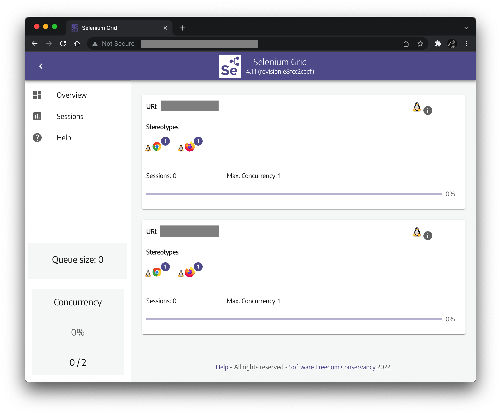

# Selenium Grid Configuration

I created a [Selenium Grid](https://www.selenium.dev/documentation/grid/)
instance using Ubuntu droplets on [Digital Ocean](https://www.digitalocean.com/).
This directory contains the `*.toml` configuration files
and `*.sh` launch scripts for running my Selenium Grid instance.
I shared these files to help you set up your own Selenium Grid.

Here's some info about the Selenium Grid I created:

* I used Selenium Grid 4.1.1 with the hub and node architecture.
  You can download the JAR file from the [Selenium Downloads page](https://www.selenium.dev/downloads/). 
* I created 3 droplets on Digital Ocean:
  1 for the hub and 2 for the nodes.
* Each droplet had 1 vCPU, 1GB memory, and 25GB disk.
* On each droplet, I manually installed:
  * Java Development Kit (JDK) 17
  * the latest versions of Chrome and ChromeDriver
  * the latest versions of Firefox and geckodriver
  * the Selenium Server JAR file
* Due to the size of each node, I limited max sessions to 1 per node.
* Selenium Grid processed had to be started manually.
* All browser sessions had to be headless, or else they wouldn't work.

My Selenium Grid instance looked like this:

It is a *very* minimal implementation to use exclusively for demo purposes.
A "real" or "serious" Selenium Grid should have:

* more compute power
* more nodes
* more browser types
* more platforms
* [observability](https://www.selenium.dev/documentation/grid/advanced_features/observability/)
  (logging, tracing, etc.)
* launch at startup
* possibly the [distributed](https://www.selenium.dev/documentation/grid/getting_started/#distributed) architecture
  instead of the [hub and node](https://www.selenium.dev/documentation/grid/getting_started/#hub-and-nodes) architecture
* possibly scale-out with containers or Kubernetes

*Warning: Digital Ocean resources are **NOT** free.
You will need to pay for any resources you create.
The droplets I created each cost $5/month.*
